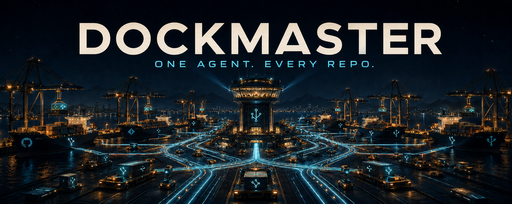
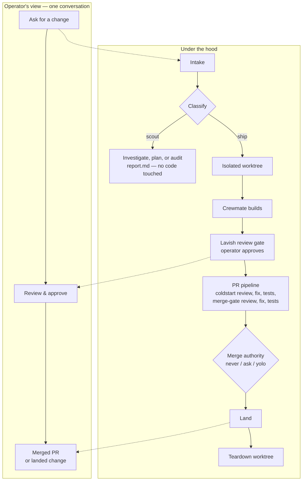
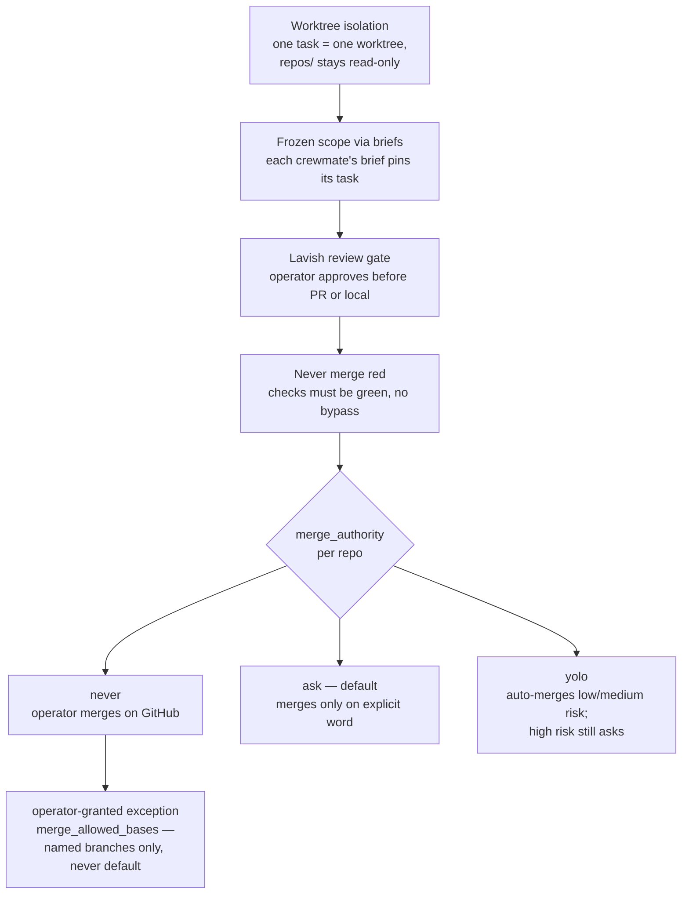

<p align="center"></p>

# dockmaster

**Talk to one agent. Ship across every repo.**

> Latest release v0.2.0 · MIT licensed · Claude Code adapter released; the
> OpenAI Codex adapter is on `main` but not yet in a tagged release
> ([CHANGELOG](CHANGELOG.md))

[](https://github.com/mengsig/dockmaster/actions/workflows/ci.yml)

*The Dockyard.* You are the captain; the **dockmaster** runs your dockyard — it
never handles cargo itself, but directs a crew of dockhands (crewmates) working in
the holds, hoisting cargo aboard the ships of your fleet, and reports back to you. See
[the theme note](docs/architecture.md#the-dockyard) for the full mapping.

dockmaster is an *agent distro* for Claude Code and OpenAI Codex: portable shared
instructions, runtime-native skill adapters, and helper scripts that turn either
session into a fleet handler. You talk to a single **dockmaster**; it runs
autonomous workers in clean git worktrees and hands you finished PRs, approved
local merges, or investigation reports.

There is no bash daemon or terminal multiplexer. Shared lifecycle contracts stay
in `AGENTS.md` and the toolbelt; `.claude/` and `.agents/` isolate each runtime's
tool vocabulary. Both use native background collaboration and bounded waits, so
one runtime never has to interpret the other's tool calls. See
[docs/architecture.md](docs/architecture.md) and the checked
[capability matrix](docs/runtime-capabilities.md).
Installed-runtime and performance proof is recorded in
[runtime validation](docs/runtime-validation.md).

## How it works

One conversation on the surface; a small, gated pipeline underneath.



A scout never touches project code — a diagnosis is never an authorization to
implement. A ship ends torn down: the worktree disappears, the change lives on
in the repo.

### The safety model

Every change passes the same operator-controlled gates, in order:



### Capabilities at a glance

- **Parallel autonomous workers** — independent tasks dispatch in bounded
  waves, each in its own worktree, so they never collide.
- **Two-pass reviews** — coldstart then merge-gate, each followed by a fix and
  a test run, before a PR is even opened.
- **Campaigns across repos** — one intent ("bump this dependency everywhere")
  fans out to one ordinary, gated child task per repo.
- **Persistent memory** — per-repo knowledge commits with the work that
  produced it; operator and fleet-wide facts stay in global memory.
- **Scout reports** — investigations end in a written report, never an
  unauthorized change.
- **Portable state** — the registry, task history, backlog, and memory export to
  one checksummed archive and restore into a fresh checkout (see
  [Backup and recovery](#backup-and-recovery)).

## What it does

- **One liaison.** You talk only to the dockmaster; it delegates, supervises, and
  reports outcomes — never mechanics.
- **A crew in worktrees.** Every task runs in its own disposable git worktree, so
  parallel work on one repo never collides.
- **Two task shapes.** *Ship* delivers a change (PR or approved local merge);
  *scout* investigates and leaves a report — a diagnosis is never an
  authorization to implement.
- **Per-repo + global memory.** Memory is plain markdown, no bespoke tool. Each
  managed repo gets three stores: shared knowledge as committed per-note files
  under a tracked `.dm-knowledge/` directory (so it travels to every clone and
  worktree, and two concurrent tasks never collide on one hot file); private
  notes in a git-excluded `.dm/notes.md`, which stay out of project history but
  *are* relayed into crewmate briefs; and dockmaster-only notes in `.dm/private.md`,
  which are never relayed. Operator and fleet-wide knowledge live in the
  dockmaster's global memory. One owner per fact.
- **Lavish approval, then modular PR pipelines.** Every change is first rendered
  as a lavish artifact you approve (with back-and-forth); then you choose PR or
  local. (The artifact needs the optional `lavish-axi`; without it you approve
  the change directly — see Requirements.) On the PR path, delivery is an
  ordered list of named gates — two review
  passes (coldstart → fix+tests → merge-gate → fix+tests) then PR — declared per
  repo in one JSON array you can reorder. Branches follow `<type>/<issue>/<slug>`;
  descriptions are short and human; nothing merges without your word.
- **Native supervision.** Crewmates run through the active runtime's background
  collaboration surface; mailbox/completion events are the wake. External waits
  use bounded command waits or scheduled tasks, never a polling daemon.
- **Guarded by construction.** The dockmaster is read-only over your repos except
  for narrow, guarded fast-forward paths. Teardown refuses to discard unlanded
  work. Nothing merges red or without your word.
- **Fleet campaigns.** One intent that spans many repos ("bump this dependency
  everywhere") fans out to one ordinary, gated child task per repo, tracked and
  reported as a single campaign.
- **Fleet PR/health sweep.** A read-only sweep across every open PR reports its
  CI rollup and whether a reviewer requested changes, surfaced in the status
  snapshot — no per-repo polling.
- **CI on every PR and every push to main.** This distro's own smoke suite and
  syntax/lint checks run on GitHub Actions across ubuntu and macOS.
- **Persistent domain supervisors.** For large domains, delegate to a long-lived
  agent that owns a scope, keeps its own memory, and runs its own crew.

## Layout

```
AGENTS.md            runtime-neutral operating contract
docs/architecture.md the design and why it is built this way
bin/                 the toolbelt; run `bin/dm help` for the full list (`bin/dm <sub>` dispatches to `bin/dm-<sub>.sh`)
.claude/skills/      Claude-native workflow adapters
.agents/skills/      Codex-native workflow adapters
.codex/              trusted-project Codex nesting and safety config
.dm-knowledge/       this repo's own committed shared-memory notes
workflows/           optional deterministic PR-pipeline runner
config/              PR-pipeline defaults and per-repo overrides
tests/               lifecycle, parity, runtime, and performance checks
.github/             CI workflow (smoke + syntax on ubuntu + macos)
CONTRIBUTING.md      how to test, portability rules, branch/commit style
SECURITY.md          trust model and private vulnerability reporting
LICENSE              MIT
assets/              logo and theme assets
state/ repos/ data/  operator-private runtime, clones, and artifacts (gitignored)
```

## Getting started

1. **Clone** this repository and `cd` into it.
2. **Run `bin/dm-doctor.sh`** — it checks your tools and GitHub auth and
   scaffolds the runtime layout (`state/`, `data/`, `repos/`).
3. **Launch Claude Code or Codex** in the repo root and accept its project trust
   prompt. Claude loads `CLAUDE.md` → `AGENTS.md`; Codex loads `AGENTS.md` and
   the trusted `.codex/config.toml` layer.
4. **Ask it to add a repo** and give it work (see Quick start).

## Quick start

```sh
# from a Claude Code or Codex session started in this directory:
> add my repo git@github.com:me/app.git and fix the flaky login test in #412
```

The dockmaster registers the repo (cloning it and seeding its memory) and spawns
a crewmate in a fresh worktree. It pauses for your approval of the change and
your PR-or-local choice before opening anything, then runs the PR pipeline and
comes back with:

```
PR ready for review: https://github.com/me/app/pull/57
(fix flaky login test — risk: low — tests green)

> merge it
```

The PR half of that exchange needs an authenticated `gh` (see Requirements);
without it the same flow ends in an approved local landing instead of a PR.

Under the hood that is `bin/dm-repo.sh add` (which clones and scaffolds the
repo's memory, then prompts the dockmaster to dispatch an onboarding scout that
proposes a test command and starter knowledge for a repo new to the fleet),
`bin/dm-task.sh new`, `bin/dm-worktree.sh create`, the `pr-workflow` skill, and
`bin/dm-pr.sh merge` — each usable directly, or through the `bin/dm` dispatcher
(`dm <sub> ...` runs `bin/dm-<sub>.sh ...`; `dm help` lists the subcommands).
Run any script with no arguments for its usage.

## Backup and recovery

`state/` is the system of record — the registry, every task record, the backlog,
and the memory that makes the fleet improve. It is gitignored local files, so
back it up:

```sh
bin/dm-state.sh export --with-artifacts --out ~/backups/dockmaster-$(date -u +%Y%m%d).tar.gz
bin/dm-state.sh verify ~/backups/dockmaster-20260721.tar.gz
```

To recover onto a new machine, clone this repo, then import. There is no target
flag: the archive lands in `$DM_HOME` — the checkout you run it from, or an
explicit `DM_HOME` you set. You choose the root; nothing inside the archive can
redirect where its contents go.

```sh
bin/dm-state.sh import ~/backups/dockmaster-20260721.tar.gz
```

Import prints what it could not carry and how to re-establish it, then run
`bin/dm-doctor.sh`. What you should know before relying on it:

- **The archive is a secret.** It contains the dockmaster-only memory store
  (`repos/<repo>/.dm/private.md`), operator preferences, and — with
  `--with-artifacts` — briefs and scout reports. Exporting moves that past the
  machine boundary it was written under. It is written mode 0600; store it
  encrypted, and do not commit it to a repo without reviewing the contents.
- **Managed clones and live worktrees are not in it.** Clones are re-clonable
  from the registry's remotes (the import prints the command per repo). Work
  committed in a worktree but never landed is single-copy and is *not* carried —
  push it, or land it, if you want it to survive. Your runtime's native
  `memory/` also lives outside `$DM_HOME` and is not carried; back it up with the
  rest of your runtime configuration.
- **Export is read-only** and never mutates `state/`. **Import never deletes**
  files the archive does not carry, and refuses a populated state root unless you
  pass `--force`, after naming every file it would replace.
- **Import has no rollback.** Files are installed one at a time, so a failure
  part-way (an unwritable path, a full disk) leaves the root partially restored.
  The error says how many landed; fix the cause and re-run with `--force`.
- **Consistency is per-file, not point-in-time.** Each record is copied while
  holding the same lock its writers take, so nothing in the archive is a torn
  mid-write file — but the archive is not one atomic snapshot. For a clean
  snapshot, export when no crew work is in flight.

`docs/architecture.md` has the full record set and the reasoning.

## Requirements

Supported platforms: macOS and Linux; the scripts run on bash 3.2+.

- **Required for anything:** one authenticated runtime (Claude Code or Codex),
  plus `git` and `jq`. Select explicitly with `bin/dm-doctor.sh check --runtime
  claude|codex`; the default `auto` accepts either and never requires both.
- **Local-only mode needs nothing further.** Worktree isolation, scouts, the
  review gate, tests, and approved fast-forward landing all work with just the
  above.
- **Required for the PR flow:** the GitHub CLI `gh`, authenticated with
  `gh auth login` — and nothing else. Every GitHub call the toolbelt makes runs
  on plain `gh`: reads (`dm-pr.sh check`, `await-checks`, `sweep`) through
  `gh api`, and all three mutations through it too — `dm-pr.sh open` uses
  `gh pr create`, `dm-pr.sh merge` uses `gh api --method PUT`, and
  `dm-repo.sh create` uses `gh repo create`.
- **Optional, and none of it gates the PR flow:** `gh-axi` (the maintainer's
  wrapper — when installed it is *preferred* for those three mutations, and the
  task record it produces is identical either way), `lavish-axi` (renders the
  review artifact; without it the dockmaster prints the change and you approve
  directly), and `chrome-devtools-axi` (browser tasks only). All three degrade
  cleanly.

> **What you see without the maintainer's wrappers.** `bin/dm-doctor.sh` lists
> all three under OPTIONAL with the feature each one gates, and the verdict stays
> a plain `READY` — no toolbelt command depends on them. What *does* qualify the
> verdict is `gh` itself: missing or unauthenticated, doctor reports
> `READY (LOCAL-ONLY)`, names the reason and the fix, and still exits 0 because
> local-only delivery is a real mode. One residue: three skill files still
> *instruct* the dockmaster to reach for `gh-axi` — `pr view --comments`,
> `pr revert`, and `repo create`. Plain `gh` accepts all three verbatim, so
> nothing is unreachable; the wording is corrected in
> [#133](https://github.com/mengsig/dockmaster/issues/133).

Per-repo memory is plain markdown — no extra tool to install. Run
`bin/dm-doctor.sh` to see what you have and what each tool gates.

Node.js is not a toolbelt/runtime dependency. Repository JS validation requires
Node 14 or newer; CI checks that documented minimum. CLI startup timing is an
opt-in, bounded, non-fatal diagnostic:
`DM_RUNTIME_STARTUP_SAMPLE=1 bash tests/runtime-performance.sh`.

Run `node tests/check-runtime-parity.js` for adapter/capability drift,
`bash tests/runtime-performance.sh` for context guardrails, and
`bash tests/runtime-smoke.sh` for installed-runtime structured discovery,
trusted rule/hook guardrails, and config checks. Runtime smoke deletes its
evidence on success or failure; add `--keep-evidence` only when sanitized
version/status artifacts are needed for a report.

## License

MIT — see [LICENSE](LICENSE). Changelog in [CHANGELOG.md](CHANGELOG.md).
