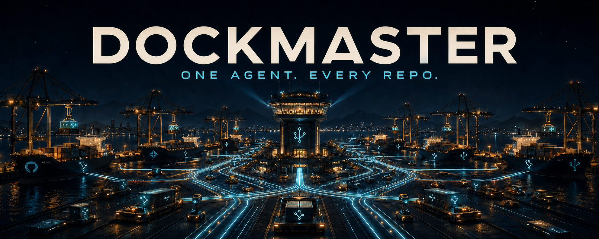
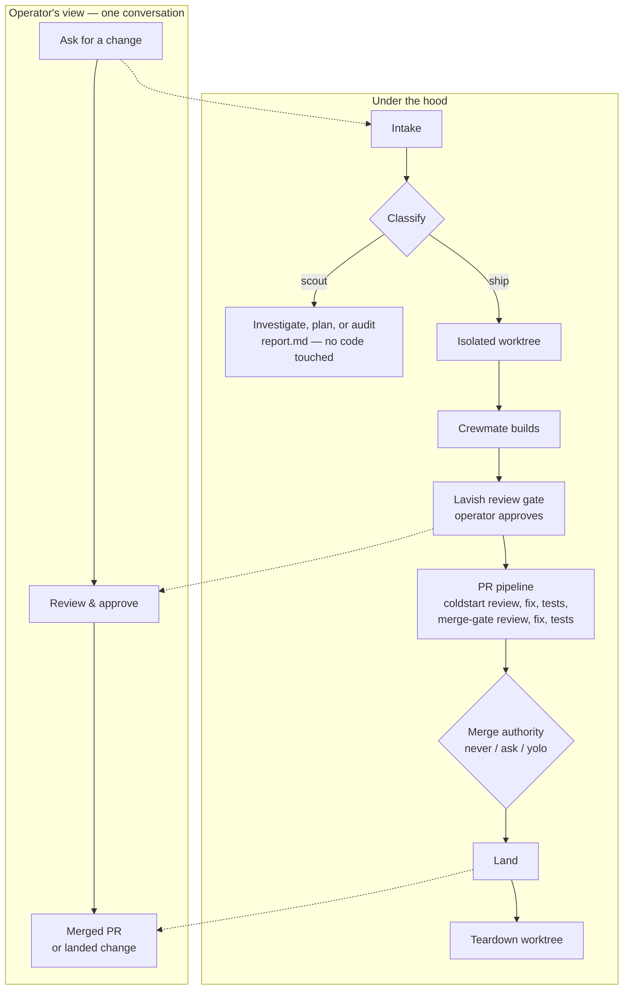
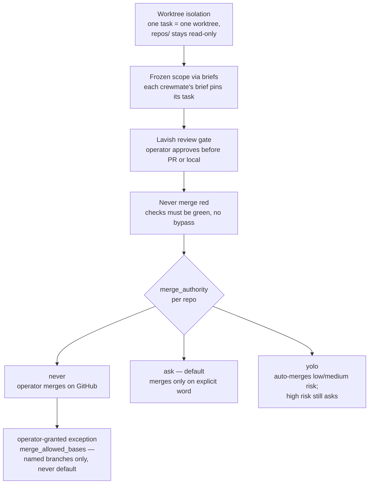

<p align="center"></p>

# dockmaster

**Talk to one agent. Ship across every repo.**

> Latest release v0.2.0 · MIT licensed · ([CHANGELOG](CHANGELOG.md))

[](https://github.com/mengsig/dockmaster/actions/workflows/ci.yml)

*The Dockyard.* You are the captain; the **dockmaster** runs your dockyard — it
never handles cargo itself, but directs a crew of dockhands (crewmates) working in
the holds, hoisting cargo aboard the ships of your fleet, and reports back to you. See
[the theme note](docs/architecture.md#the-dockyard) for the full mapping.

dockmaster is an *agent distro* for Claude Code: a portable operating contract,
skills, and helper scripts that turn one session into a fleet handler. You talk
to a single **dockmaster**; it runs autonomous workers in clean git worktrees and
hands you finished PRs, approved local merges, or investigation reports.

There is no bash daemon or terminal multiplexer. Lifecycle contracts live in
`AGENTS.md` and the toolbelt; `.claude/skills/` holds the workflow skills, loaded
at the trigger points the contract names. Background work uses the runtime's own
agents and bounded waits. See [docs/architecture.md](docs/architecture.md).

## How it works

One conversation on the surface; a small, gated pipeline underneath.


```mermaid
flowchart TB
    subgraph OP["Operator's view — one conversation"]
        direction LR
        A["Ask for a change"] --> B["Review & approve"] --> C["Merged PR<br/>or landed change"]
    end

    subgraph HOOD["Under the hood"]
        D["Intake"] --> E{"Classify"}
        E -->|scout| S["Investigate, plan, or audit<br/>report.md — no code touched"]
        E -->|ship| F["Isolated worktree"]
        F --> G["Crewmate builds"]
        G --> H["Lavish review gate<br/>operator approves"]
        H --> I["PR pipeline<br/>coldstart review, fix, tests,<br/>merge-gate review, fix, tests"]
        I --> J{"Merge authority<br/>never / ask / yolo"}
        J --> K["Land"]
        K --> L["Teardown worktree"]
    end

    A -.-> D
    H -.-> B
    K -.-> C
```

A scout never touches project code — a diagnosis is never an authorization to
implement. A ship ends torn down: the worktree disappears, the change lives on
in the repo.

### The safety model

Every change passes the same operator-controlled gates, in order:


```mermaid
flowchart TD
    W["Worktree isolation<br/>one task = one worktree,<br/>repos/ stays read-only"]
    B["Frozen scope via briefs<br/>each crewmate's brief pins its task"]
    R["Lavish review gate<br/>operator approves before PR or local"]
    G["Never merge red<br/>checks must be green, no bypass"]
    MA{"merge_authority<br/>per repo"}
    N["never<br/>operator merges on GitHub"]
    K["ask — default<br/>merges only on explicit word"]
    Y["yolo<br/>auto-merges low/medium risk;<br/>high risk still asks"]
    NX["operator-granted exception<br/>merge_allowed_bases —<br/>named branches only, never default"]

    W --> B --> R --> G --> MA
    MA --> N --> NX
    MA --> K
    MA --> Y
```

### Capabilities at a glance

- **Parallel autonomous workers** — independent tasks dispatch in bounded
  waves, each in its own worktree, so they never collide.
- **Two-pass reviews** — coldstart then merge-gate, each followed by a fix and
  a test run, before a PR is even opened.
- **Campaigns across repos** — one intent ("bump this dependency everywhere")
  fans out to one ordinary, gated child task per repo.
- **Persistent memory** — per-repo knowledge commits with the work that
  produced it; operator and fleet-wide facts stay in global memory.
- **Scout reports** — investigations end in a written report, never an
  unauthorized change.
- **A local console** — `/dockmaster` opens one page on 127.0.0.1 carrying the
  conversation plus what needs you, where each change actually stands, every open
  PR, repos, backlog, decisions and the review archive. Node stdlib only: no build
  step, no dependency, works offline. It reads state solely through the toolbelt.
- **Portable state** — the registry, task history, backlog, and memory export to
  one checksummed archive and restore into a fresh checkout (see
  [Backup and recovery](#backup-and-recovery)).

## What it does

- **One liaison.** You talk only to the dockmaster; it delegates, supervises, and
  reports outcomes — never mechanics.
- **A crew in worktrees.** Every task runs in its own disposable git worktree, so
  parallel work on one repo never collides.
- **Two task shapes.** *Ship* delivers a change (PR or approved local merge);
  *scout* investigates and leaves a report — a diagnosis is never an
  authorization to implement.
- **Per-repo + global memory.** Memory is plain markdown, no bespoke tool. Each
  managed repo gets three stores: shared knowledge as committed per-note files
  under a tracked `.dm-knowledge/` directory (so it travels to every clone and
  worktree, and two concurrent tasks never collide on one hot file); private
  notes in a git-excluded `.dm/notes.md`, which stay out of project history but
  *are* relayed into crewmate briefs; and dockmaster-only notes in `.dm/private.md`,
  which are never relayed. Operator and fleet-wide knowledge live in the
  dockmaster's global memory. One owner per fact.
- **Lavish approval, then modular PR pipelines.** Every change is first rendered
  as a lavish artifact you approve (with back-and-forth); then you choose PR or
  local. (The artifact needs the optional `lavish-axi`; without it you approve
  the change directly — see Requirements.) On the PR path, delivery is an
  ordered list of named gates — two review
  passes (coldstart → fix+tests → merge-gate → fix+tests) then PR — declared per
  repo in one JSON array you can reorder. Branches follow `<type>/<issue>/<slug>`;
  descriptions are short and human; nothing merges without your word.
- **Native supervision.** Crewmates run as background agents; their completion
  notifications are the wake. External waits
  use bounded command waits or scheduled tasks, never a polling daemon.
- **Guarded by construction.** The dockmaster is read-only over your repos except
  for narrow, guarded fast-forward paths. Teardown refuses to discard unlanded
  work. Nothing merges red or without your word.
- **Fleet campaigns.** One intent that spans many repos ("bump this dependency
  everywhere") fans out to one ordinary, gated child task per repo, tracked and
  reported as a single campaign.
- **Fleet PR/health sweep.** A read-only sweep across every open PR reports its
  CI rollup and whether a reviewer requested changes, surfaced in the status
  snapshot — no per-repo polling.
- **CI on every PR and every push to main.** This distro's own smoke suite and
  syntax/lint checks run on GitHub Actions across ubuntu and macOS.
- **Persistent domain supervisors.** For large domains, delegate to a long-lived
  agent that owns a scope, keeps its own memory, and runs its own crew.

## Layout

```
AGENTS.md            the operating contract
docs/architecture.md the design and why it is built this way
bin/                 the toolbelt; run `bin/dm help` for the full list (`bin/dm <sub>` dispatches to `bin/dm-<sub>.sh`)
.claude/skills/      the workflow skills
.dm-knowledge/       this repo's own committed shared-memory notes
config/              PR-pipeline defaults and per-repo overrides
ui/                  the local console served by `bin/dm-ui.sh` (no build step)
tests/               lifecycle, runtime, and performance checks
.github/             CI workflow (smoke + syntax on ubuntu + macos)
CONTRIBUTING.md      how to test, portability rules, branch/commit style
SECURITY.md          trust model and private vulnerability reporting
LICENSE              MIT
assets/              logo and theme assets
state/ repos/ data/  operator-private runtime, clones, and artifacts (gitignored)
```

## Getting started

1. **Clone** this repository and `cd` into it.
2. **Run `bin/dm-doctor.sh`** — it checks your tools and GitHub auth and
   scaffolds the runtime layout (`state/`, `data/`, `repos/`).
3. **Launch Claude Code** in the repo root and accept its project trust prompt.
   It loads `CLAUDE.md` → `AGENTS.md`.
4. **Ask it to add a repo** and give it work (see Quick start).

## Quick start

```sh
# from a Claude Code session started in this directory:
> add my repo git@github.com:me/app.git and fix the flaky login test in #412
```

The dockmaster registers the repo (cloning it and seeding its memory) and spawns
a crewmate in a fresh worktree. It pauses for your approval of the change and
your PR-or-local choice before opening anything, then runs the PR pipeline and
comes back with:

```
PR ready for review: https://github.com/me/app/pull/57
(fix flaky login test — risk: low — tests green)

> merge it
```

The PR half of that exchange needs an authenticated `gh` (see Requirements);
without it the same flow ends in an approved local landing instead of a PR.

Under the hood that is `bin/dm-repo.sh add` (which clones and scaffolds the
repo's memory, then prompts the dockmaster to dispatch an onboarding scout that
proposes a test command and starter knowledge for a repo new to the fleet),
`bin/dm-task.sh new`, `bin/dm-worktree.sh create`, the `pr-workflow` skill, and
`bin/dm-pr.sh merge` — each usable directly, or through the `bin/dm` dispatcher
(`dm <sub> ...` runs `bin/dm-<sub>.sh ...`; `dm help` lists the subcommands).
Run any script with no arguments for its usage.

## Backup and recovery

`state/` is the system of record — the registry, every task record, the backlog,
and the memory that makes the fleet improve. It is gitignored local files, so
back it up:

```sh
bin/dm-state.sh export --with-artifacts --out ~/backups/dockmaster-$(date -u +%Y%m%d).tar.gz
bin/dm-state.sh verify ~/backups/dockmaster-20260721.tar.gz
```

To recover onto a new machine, clone this repo, then import. There is no target
flag: the archive lands in `$DM_HOME` — the checkout you run it from, or an
explicit `DM_HOME` you set. You choose the root; nothing inside the archive can
redirect where its contents go.

```sh
bin/dm-state.sh import --dry-run ~/backups/dockmaster-20260721.tar.gz  # plan only
bin/dm-state.sh import ~/backups/dockmaster-20260721.tar.gz
```

Import prints what it could not carry and how to re-establish it, then run
`bin/dm-doctor.sh`. What you should know before relying on it:

- **The archive is operator-private — do not share it.** It contains the
  dockmaster-only memory store (`repos/<repo>/.dm/private.md`), operator
  preferences, and — with `--with-artifacts` — briefs and scout reports. It also
  discloses the exporting machine's directory layout: the manifest records
  `source_home` and task records carry absolute worktree paths, both as absolute
  paths. That is deliberate — a restore needs them — but it means the archive is
  a backup for *you*, not an artifact to hand to anyone or attach to an issue.
  Exporting moves all of that past the machine boundary it was written under. It
  is written mode 0600; store it encrypted, and never commit it to a repo.
- **Managed clones and live worktrees are not in it.** Clones are re-clonable
  from the registry's remotes (the import prints the command per repo). Work
  committed in a worktree but never landed is single-copy and is *not* carried —
  push it, or land it, if you want it to survive. Your runtime's native
  `memory/` also lives outside `$DM_HOME` and is not carried; back it up with the
  rest of your runtime configuration.
- **Export is read-only** and never mutates `state/`. It also **verifies the
  archive it just wrote** before reporting success, and deletes it if it fails —
  a backup tool must never call an archive good that it would itself refuse to
  restore.
- **Symlinks are skipped, not followed.** `verify` refuses a non-regular member,
  so `--with-artifacts` skips any symlink under `data/` (npm and playwright
  leave them in `node_modules/.bin/`) and names each one in the export summary.
  They are not dereferenced: following one would pull unrelated out-of-tree
  content into your backup. Re-create them with the tool that made them.
- **Import never deletes** files the archive does not carry, and refuses a
  populated state root unless you pass `--force`, after naming every file it
  would replace. Because `state/repos.json` is replaced wholesale, importing an
  older archive can leave on-disk data it no longer references — use
  `--dry-run` first if you are unsure.
- **A stale archive will not silently overwrite newer state.** If a local file
  is newer than the archive's copy of it — written after the export — `--force`
  refuses and names it; add `--overwrite-newer` to replace it anyway. Every
  replaced file is copied to `state/backups/pre-import-<UTC>/` before it is
  overwritten, so nothing is discarded without a recoverable copy.
- **Import has no rollback.** Files are installed one at a time, so a failure
  part-way (an unwritable path, a full disk) leaves the root partially restored.
  The error says how many landed and where their pre-import copies are; fix the
  cause and re-run with `--force`.
- **Consistency is per-file, not point-in-time.** Each record is copied while
  holding the same lock its writers take, so nothing in the archive is a torn
  mid-write file — but the archive is not one atomic snapshot. For a clean
  snapshot, export when no crew work is in flight.

`docs/architecture.md` has the full record set and the reasoning.

## Requirements

Supported platforms: macOS and Linux; the scripts run on bash 3.2+.

- **Required for anything:** an authenticated Claude Code CLI, plus `git` and
  `jq`. `bin/dm-doctor.sh check` reports all three.
- **Local-only mode needs nothing further.** Worktree isolation, scouts, the
  review gate, tests, and approved fast-forward landing all work with just the
  above.
- **Required for the PR flow:** the GitHub CLI `gh`, authenticated with
  `gh auth login` — and nothing else. Every GitHub call the toolbelt makes runs
  on plain `gh`: reads (`dm-pr.sh check`, `await-checks`, `sweep`) through
  `gh api`, and all three mutations through it too — `dm-pr.sh open` uses
  `gh pr create`, `dm-pr.sh merge` uses `gh api --method PUT`, and
  `dm-repo.sh create` uses `gh repo create`.
- **Optional, and none of it gates the PR flow:** `gh-axi` (the maintainer's
  wrapper — when installed it is *preferred* for those three mutations, and the
  task record it produces is identical either way), `lavish-axi` (renders the
  review artifact; without it the dockmaster prints the change and you approve
  directly), and `chrome-devtools-axi` (browser tasks only). All three degrade
  cleanly.

> **What you see without the maintainer's wrappers.** `bin/dm-doctor.sh` lists
> all three under OPTIONAL with the feature each one gates, and the verdict stays
> a plain `READY` — no toolbelt command depends on them. What *does* qualify the
> verdict is `gh` itself: missing or unauthenticated, doctor reports
> `READY (LOCAL-ONLY)`, names the reason and the fix, and still exits 0 because
> local-only delivery is a real mode. One residue: three skill files still
> *instruct* the dockmaster to reach for `gh-axi` — `pr view --comments`,
> `pr revert`, and `repo create`. Plain `gh` accepts all three verbatim, so
> nothing is unreachable; the wording is corrected in
> [#133](https://github.com/mengsig/dockmaster/issues/133).

Per-repo memory is plain markdown — no extra tool to install. Run
`bin/dm-doctor.sh` to see what you have and what each tool gates.

Node.js is not a toolbelt/runtime dependency. Repository JS validation requires
Node 14 or newer; CI checks that documented minimum. CLI startup timing is an
opt-in, bounded, non-fatal diagnostic:
`DM_RUNTIME_STARTUP_SAMPLE=1 bash tests/runtime-performance.sh`.

Run `node tests/check-skill-triggers.js` for skill/trigger drift,
`bash tests/runtime-performance.sh` for context guardrails, and
`bash tests/runtime-smoke.sh` for Claude CLI/config compatibility and
installed-CLI checks. Runtime smoke deletes its evidence on success or
failure; add `--keep-evidence` only when sanitized version/status artifacts
are needed for a report.

## Environment

Every toolbelt override, with its default. Nothing here is required — the
defaults are the supported configuration.

| variable | default | effect |
|---|---|---|
| `DM_HOME` | the clone containing `bin/` | Distro root. `state/`, `data/`, `repos/` and `config/` are all derived from it, so setting it relocates the whole runtime — a throwaway root for dogfooding, or a state directory outside the clone. Script paths follow `bin/` itself, not this. |
| `DM_NO_FETCH` | unset | `1` makes every reconcile offline: no `git fetch`, no GitHub read. `dm-status.sh` sets it for its own read-only snapshot. |
| `DM_STUCK_AGE_HOURS` | `4` | Age at which `dm-status.sh` flags a non-terminal task as possibly stuck. A non-positive or non-numeric value warns and falls back to the default. |
| `DM_RECALL_MAX_LINES` | `40` | Per-store soft cap on `dm-memory.sh recall` output. Over the cap, recall prints a tail pointer naming how to see the rest. |
| `DM_GH_RETRY_MAX` | `4` | Attempts `dm-pr.sh` makes against a retryable GitHub failure. |
| `DM_GH_RETRY_BASE_SECS` | `2` | Backoff base for those retries. |
| `DM_GH_CIRCUIT_BREAKER_MAX` | `5` | Consecutive GitHub failures after which `dm-pr.sh` stops calling out. |
| `DM_VERIFY_READY_TIMEOUT` | `300` | Seconds `bin/dm-verify.sh up` waits for the app to prove itself ready before failing the boot. |
| `DM_VERIFY_STOP_SETTLE` | `20` | Seconds `dm-verify.sh down` waits for the app's port to go quiet after `app_stop_cmd`. Still listening at the end records `leaked` and fails, rather than claiming a stop it did not achieve. |
| `DM_VERIFY_LEASE_TIMEOUT` | `600` | Seconds a crewmate waits for the shared verification browser when it could not get one of its own, before failing visibly and naming the holder. |
| `DM_VERIFY_BROWSER_BIN` | unset | Chrome/Chromium `dm-verify.sh session` launches for a task. Unset searches `PATH`, then the newest Playwright-managed Chromium. |
| `DM_VERIFY_BROWSER_SHARED` | unset | `1` forces the degraded shared-browser path (exclusive lease instead of a per-task browser). Used by the tests; set it only to reproduce that path. |
| `DM_RUNTIME_STARTUP_SAMPLE` | unset | `1` enables the opt-in CLI startup timing diagnostic in `tests/runtime-performance.sh`. |
| `DM_UI_PORT` | `4877` | Loopback port `bin/dm-ui.sh` serves the console on. Chosen clear of lavish (4387), chrome-devtools (9224) and the verify gate's app/bridge/CDP ranges; change it only if something else already holds 4877. |
| `DM_UI_WATCH_TIMEOUT` | `300` | Seconds `bin/dm-ui.sh watch` blocks per idle poll slice before looping again. Bounds how long any one underlying poll process runs unproven-alive; lower it (a test does) to make the idle-timeout path fast to exercise. |

## License

MIT — see [LICENSE](LICENSE). Changelog in [CHANGELOG.md](CHANGELOG.md).
